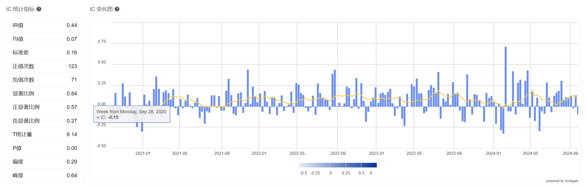
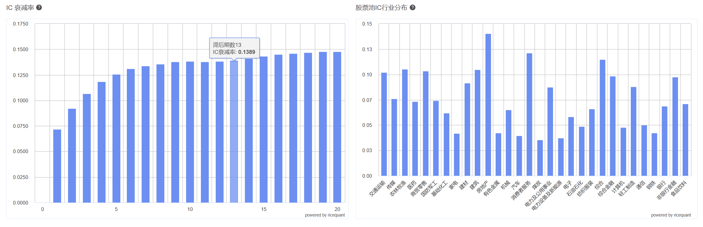
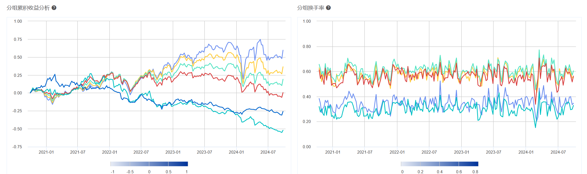
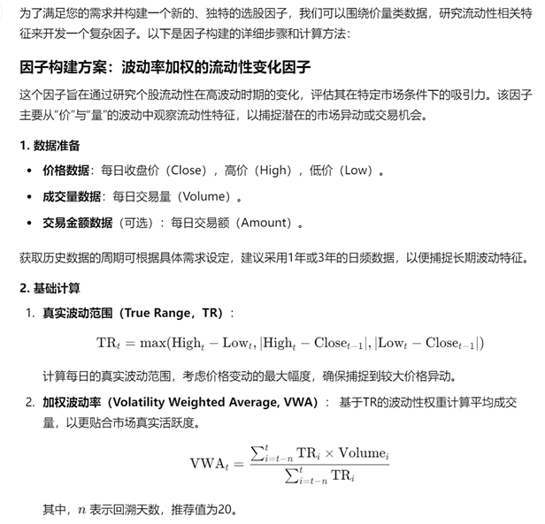
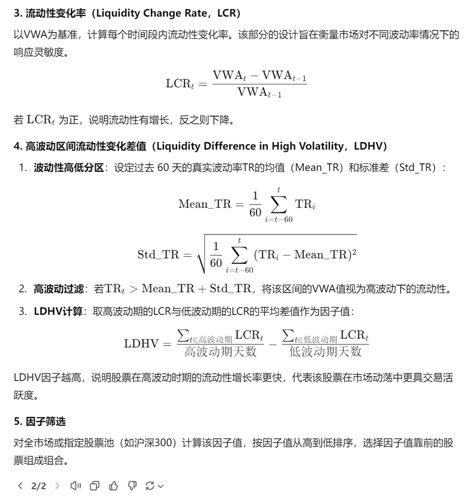

# StockFactor\_code

基于证券交易大数据的 AI 模型选股因子多路径挖掘探索项目代码库。该项目综合运用遗传规划（GP）、随机森林、以及大语言模型（LLM）等多种路径，自动化挖掘出具有预测价值的量化选股因子，辅助构建多因子策略组合并实现实盘级别的因子验证与回测。

## 📌 项目亮点

* 🧠 多路径因子挖掘：整合 GP、LLM 等方法，提升因子多样性与预测能力
  
* 🧮 自定义函数集拓展 gplearn，用于表达复杂的非线性量价关系
* 🤖 使用 GPT/Kimi 大模型生成因子表达式，探索 NLP 在金融因子构建的应用
* 📊 支持完整因子回测分析：IC、IR、收益率、行业分布、换手率
* 📈 可视化热力图展示因子表现，并支持多因子组合策略设计与验证

---

## 🗂️ 项目结构

```
StockFactor_code/
├── examples/               # 示例因子构建流程
├── gp/                    # 基于遗传规划的因子挖掘模块
│   ├── function_set.py    # 自定义函数集
│   ├── get_data.py        # 数据读取与预处理
│   ├── new_gp.py          # 遗传规划主函数
├── strategy/              # 多因子策略构建与回测模块
│   └── factor_strategy.py
├── main.py                # 主运行入口
├── other.py               # 辅助函数集合
└── README.md              # 项目说明
```

---

## 🚀 快速开始

### 1. 克隆项目

```bash
git clone https://github.com/LeonnelTang/StockFactor_code.git
cd StockFactor_code
```

### 2. 安装依赖

建议使用虚拟环境（如 `venv` 或 `conda`）：

```bash
pip install -r requirements.txt
```

依赖包括但不限于：

* `pandas`, `numpy`
* `scikit-learn`
* `gplearn`
* `matplotlib`, `seaborn`
* `shap`

### 3. 运行示例

```bash
python main.py
```

或运行具体模块：

```bash
# 运行遗传规划因子挖掘
python gp/new_gp.py

# 回测策略构建与结果分析
python strategy/factor_strategy.py
```

---

## 📘 示例因子表达式（GP 生成）

```python
Alpha1 = mul(div(log(abs(total_turnover_Lag1)), SIGN(volume_Lag20)),
             EMA(div(high, high_Lag20)))
```

**年化收益率**：19.72%
**多空累计收益**：105.41%

---

## 📊 示例可视化

* IC 时间序列图
  
  
* 多空组合收益曲线
  
* 因子暴露热力图
  


示例文件输出：

```
factor_0.0001_HS300.csv
heatmap_0.0001_HS300.png
```

---

## 🧠 项目方法概述

| 方法               | 描述                                   |
| ---------------- | ------------------------------------ |
| 遗传规划 (gplearn)   | 自动生成因子表达式，优化 RankIC，支持函数扩展           |
| 大语言模型 (GPT/Kimi) | 利用 Prompt Engineering 生成逻辑合理的选股因子表达式 |

### 遗传规划（gplearn）
基于Python的 `gplearn` 库，构建了遗传规划模型，包括因子表达式的随机生成、适应度评估和进化操作。通过自定义函数集（如指数、符号函数、时间序列最高值和最低值等）扩展了 `gplearn` 的功能，捕捉市场数据的非线性关系。训练过程使用SymbolicTransformer工具，基于自定义函数集和适应度函数（RankIC），对初始因子集进行演化筛选，提取出与收益率相关性较高的因子。目前通过遗传规划算法成功挖掘出多个具有显著预测能力的选股因子，并通过回测进行多维度分析验证其有效性。

### 大语言模型 (GPT/Kimi)
#### i. 设计的Prompt：
作为一名资深量化研究员，按照以下指令，构建一个选股因子
1.不要使用现有的技术指标去直接构建
2.构建一个新的、独特的因子
3.因子的构建逻辑不要太简单
4.考虑使用价量类数据去研究流动性
5.请给出构建的详细步骤和计算方法

#### ii. GPT生成回答示例：



### 构建多因子策略并回测验证
利用已挖掘出的有效因子，构建基于多因子的交易策略，并进行回测验证，以评估策略在不同市场环境中的表现。回测后，将经过验证的策略转入量化交易系统进行实时模拟交易。


---

## 🤝 致谢

本项目由华东师范大学创新创业培育项目支持，感谢米筐数据平台教育版支持。感谢宫峰飞副教授与韩莉副教授在技术指导方面提供的重要帮助。

